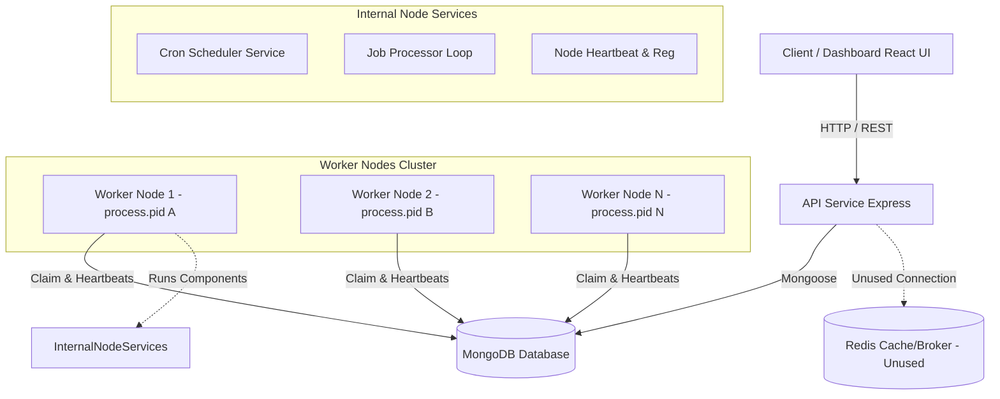
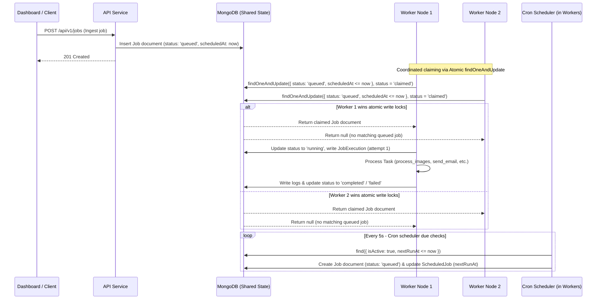

# System Architecture Documentation

This document describes the high-level system architecture of the distributed job scheduler platform.

## Architecture Diagram

The diagram below illustrates the components, services, database storage, and boundaries of the system. It shows how clients interact with the API, how workers claim workloads, and how the shared database serves as the coordination engine.

Alternatively, here is the detailed operational data flow representing concurrent worker threads claiming from the shared queue state in MongoDB:

---

## Component Responsibilities & Communication Protocols

### 1. Client / Dashboard (React SPA)
*   **Responsibility**: The user interface allows users to register accounts, sign in, configure fault tolerance retry policies, create/pause workloads queues, trigger new background jobs, audit execution run logs, and inspect active worker cluster health statistics.
*   **Communication**: Communicates exclusively via asynchronous HTTP REST requests with JSON payloads targeting the API service. All requests are authenticated with a Bearer JWT access token (stored in the browser's localStorage).

### 2. API Service (Express Server)
*   **Responsibility**: Serves as the ingestion gateway and system configuration controller. It exposes REST endpoints for registering/logging in users, managing projects, queues, retry policies, scheduled cron templates, enqueuing jobs, pausing/resuming queues, and querying dashboard stats. It performs schema-level payload validations.
*   **Communication**: Operates statelessly and talks to MongoDB via Mongoose object modeling to validate records, check org permissions, insert/update models, and query logs.

### 3. Cron Scheduler Service
*   **Responsibility**: Scans scheduled templates at regular intervals to promote due jobs to the active queue. It calculates the next execution time based on a standard cron definition and enqueues a new execution job.
*   **Communication**: Communicates via direct MongoDB polling queries. It queries the `scheduledjobs` collection every 5 seconds for due documents and writes new jobs to the `jobs` collection.
*   **Singleton Constraint Warning**: 
    > [!WARNING]
    > In the actual implementation, the `CronScheduler` is initialized and started inside *every* worker node process bootstrap (`worker/src/index.ts`). There is no leader election, distributed locking, or coordinate mechanism between scheduler instances. 
    > 
    > Consequently, the Cron Scheduler is **NOT** safe for horizontal scaling. If multiple worker node processes are run concurrently, multiple schedulers will find the same due cron templates simultaneously and enqueue duplicate job documents. To prevent duplicate executions, the scheduler must be run as a singleton (a single worker instance with scheduling enabled) or refactored to use leader-election (e.g. via Redis locks or MongoDB document locks).

### 4. Worker Node / Job Processor
*   **Responsibility**: Handles worker registration, periodic liveness heartbeat broadcasts, metrics reporting, and the continuous polling/processing loop for executing background jobs. The processor scans queues by priority, enforces queue concurrency limits, claims jobs, creates execution history records, logs task progress, computes retry delays, and handles dead-letter routing.
*   **Communication**: Communicates directly with MongoDB via Mongoose. It uses atomic writes (`findOneAndUpdate`) to claim jobs and writes metrics/execution records.
*   **Horizontal Scalability**: 
    > [!TIP]
    > Unlike the Cron Scheduler, the Worker Processor loop and Node registration services **can be scaled horizontally** indefinitely. Multiple worker processes can run simultaneously on different hosts or containers. They register independently with unique names (`worker-hostname-pid`), post separate heartbeats, and compete for queue jobs using atomic single-document operations. MongoDB ensures only one worker successfully claims a job document.

### 5. MongoDB Database
*   **Responsibility**: Serves as the central shared-state coordinator and storage engine. It houses collections for configurations, active/historical jobs, executions history, heartbeats, logs, and user metadata.
*   **Communication**: Direct TCP mongoose connections from the API server and worker node instances.

### 6. Redis (Broker / Cache)
*   **Responsibility**: The codebase contains dependencies for `ioredis` and starts Redis in local developer scripts. However, **Redis is NOT integrated into the scheduler code**. No rate limiting, pub-sub messages, or locking mechanisms utilize Redis in either the API or Worker services. All coordination relies entirely on MongoDB.
