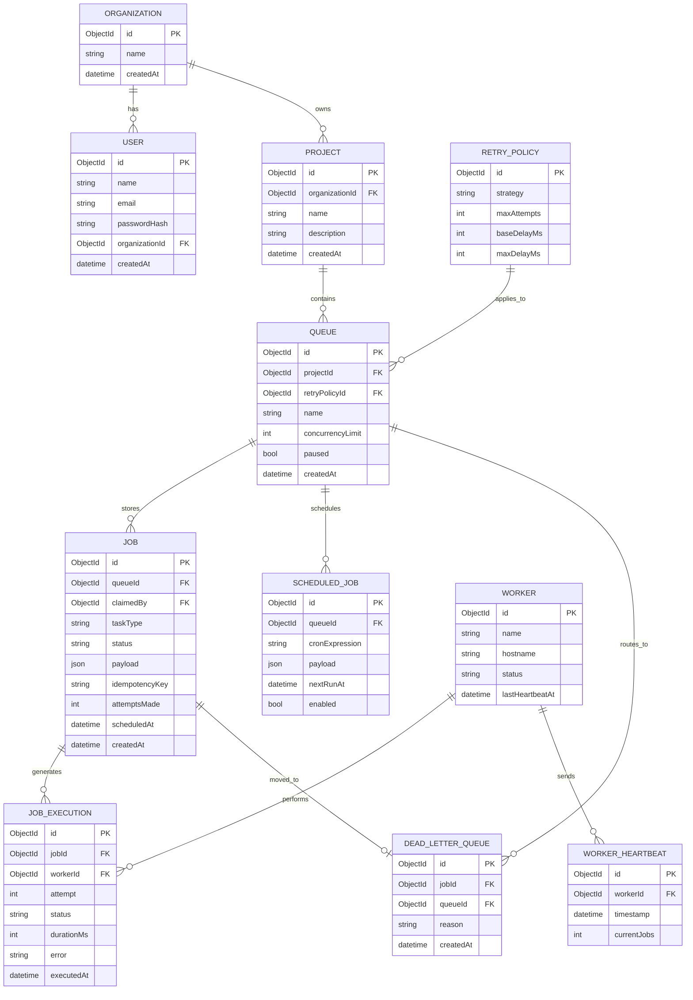

## 🗄️ Entity Relationship Diagram (ERD)

```mermaid
erDiagram

    ORGANIZATION ||--o{ USER : has
    ORGANIZATION ||--o{ PROJECT : owns
    PROJECT ||--o{ QUEUE : contains

    RETRY_POLICY ||--o{ QUEUE : applies_to

    QUEUE ||--o{ JOB : stores
    QUEUE ||--o{ SCHEDULED_JOB : schedules
    QUEUE ||--o{ DEAD_LETTER_QUEUE : routes_to

    JOB ||--o{ JOB_EXECUTION : generates
    WORKER ||--o{ JOB_EXECUTION : performs

    WORKER ||--o{ WORKER_HEARTBEAT : sends

    JOB ||--o| DEAD_LETTER_QUEUE : moved_to

    ORGANIZATION {
        ObjectId id PK
        string name
        datetime createdAt
    }

    USER {
        ObjectId id PK
        string name
        string email
        string passwordHash
        ObjectId organizationId FK
        datetime createdAt
    }

    PROJECT {
        ObjectId id PK
        ObjectId organizationId FK
        string name
        string description
        datetime createdAt
    }

    RETRY_POLICY {
        ObjectId id PK
        string strategy
        int maxAttempts
        int baseDelayMs
        int maxDelayMs
    }

    QUEUE {
        ObjectId id PK
        ObjectId projectId FK
        ObjectId retryPolicyId FK
        string name
        int concurrencyLimit
        bool paused
        datetime createdAt
    }

    JOB {
        ObjectId id PK
        ObjectId queueId FK
        ObjectId claimedBy FK
        string taskType
        string status
        json payload
        string idempotencyKey
        int attemptsMade
        datetime scheduledAt
        datetime createdAt
    }

    WORKER {
        ObjectId id PK
        string name
        string hostname
        string status
        datetime lastHeartbeatAt
    }

    WORKER_HEARTBEAT {
        ObjectId id PK
        ObjectId workerId FK
        datetime timestamp
        int currentJobs
    }

    JOB_EXECUTION {
        ObjectId id PK
        ObjectId jobId FK
        ObjectId workerId FK
        int attempt
        string status
        int durationMs
        string error
        datetime executedAt
    }

    DEAD_LETTER_QUEUE {
        ObjectId id PK
        ObjectId jobId FK
        ObjectId queueId FK
        string reason
        datetime createdAt
    }

    SCHEDULED_JOB {
        ObjectId id PK
        ObjectId queueId FK
        string cronExpression
        json payload
        datetime nextRunAt
        bool enabled
    }
```
