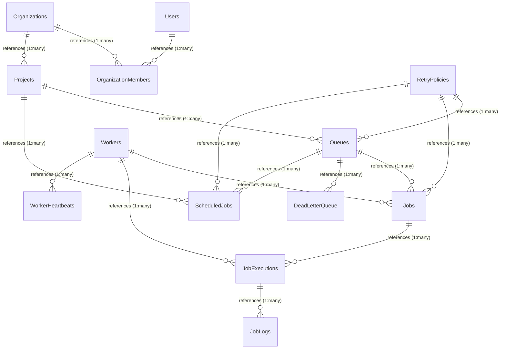

# Database Design & Schema Documentation

This document describes the schema design, field types, indexes, and relationships for the distributed job scheduler backed by MongoDB and Mongoose.

## Database Schema Diagram



---

## Detailed Collections & Schema Reference

### 1. Users (`users` collection)
Stores information about accounts registered on the platform.

*   **Fields & Types**:
    *   `_id`: `ObjectId` (Primary Key)
    *   `email`: `String` (Required, Unique, Case-sensitive)
    *   `passwordHash`: `String` (Required, Bcrypt hash)
    *   `fullName`: `String` (Optional)
    *   `createdAt`: `Date` (Automated timestamp)
    *   `updatedAt`: `Date` (Automated timestamp)
*   **Indexes**:
    *   `{ email: 1 }` (Unique): Created inline. Speeds up credential verification during user login and enforces registration constraints.
*   **Relationships**:
    *   Referenced by `OrganizationMember` via `userId`.
*   **Embedding vs. Referencing**:
    *   Users are stored in a separate collection. Referencing users from organization memberships prevents duplicating credentials and user metadata across projects, avoiding update anomalies.

---

### 2. Organizations (`organizations` collection)
Stores tenant-level boundaries.

*   **Fields & Types**:
    *   `_id`: `ObjectId` (Primary Key)
    *   `name`: `String` (Required)
    *   `slug`: `String` (Required, Unique, URL-friendly)
    *   `createdAt`: `Date` (Automated timestamp)
    *   `updatedAt`: `Date` (Automated timestamp)
*   **Indexes**:
    *   `{ slug: 1 }` (Unique): Created inline. Optimizes routing checks.
*   **Relationships**:
    *   Referenced by `OrganizationMember` via `organizationId`.
    *   Referenced by `Project` via `organizationId`.
*   **Embedding vs. Referencing**:
    *   Organizations are referenced. Since organizations contain multiple members, embedding users or projects inside the organization document would risk hitting MongoDB's 16MB document size limit (unbounded growth).

---

### 3. Organization Members (`organizationmembers` collection)
Maps users to organizations with specific permissions.

*   **Fields & Types**:
    *   `_id`: `ObjectId` (Primary Key)
    *   `organizationId`: `ObjectId` (Required, references `Organization`)
    *   `userId`: `ObjectId` (Required, references `User`)
    *   `role`: `String` (Required, Enum: `owner`, `admin`, `member`, `viewer`)
    *   `createdAt`: `Date` (Automated timestamp)
    *   `updatedAt`: `Date` (Automated timestamp)
*   **Indexes**:
    *   `{ organizationId: 1, userId: 1 }` (Unique): Ensures a user cannot be added to an organization multiple times, and speeds up membership lookup checks on API calls.
*   **Relationships**:
    *   References `Organization` via `organizationId`.
    *   References `User` via `userId`.

---

### 4. Projects (`projects` collection)
Groups queues and cron schedules under an organization.

*   **Fields & Types**:
    *   `_id`: `ObjectId` (Primary Key)
    *   `organizationId`: `ObjectId` (Required, references `Organization`)
    *   `name`: `String` (Required)
    *   `slug`: `String` (Required)
    *   `createdAt`: `Date` (Automated timestamp)
    *   `updatedAt`: `Date` (Automated timestamp)
*   **Indexes**:
    *   `{ organizationId: 1, slug: 1 }` (Unique): Enforces unique project slugs per organization and optimizes project lookup filters.
*   **Relationships**:
    *   References `Organization` via `organizationId`.
    *   Referenced by `Queue`, `RetryPolicy`, and `ScheduledJob` via `projectId`.

---

### 5. Retry Policies (`retrypolicies` collection)
Defines backoff logic configurations.

*   **Fields & Types**:
    *   `_id`: `ObjectId` (Primary Key)
    *   `projectId`: `ObjectId` (Required, references `Project`)
    *   `name`: `String` (Required)
    *   `type`: `String` (Required, Enum: `fixed`, `linear`, `exponential`)
    *   `baseDelayMs`: `Number` (Required, default: 1000)
    *   `maxDelayMs`: `Number` (Required, default: 60000)
    *   `maxAttempts`: `Number` (Required, default: 3)
    *   `createdAt`: `Date` (Automated timestamp)
    *   `updatedAt`: `Date` (Automated timestamp)
*   **Indexes**:
    *   `{ projectId: 1, name: 1 }` (Unique): Guarantees unique retry policy names within the same project.
*   **Relationships**:
    *   References `Project` via `projectId`.
    *   Referenced by `Queue`, `Job`, and `ScheduledJob` via `retryPolicyId`.

---

### 6. Queues (`queues` collection)
Job pipelines with concurrency limits.

*   **Fields & Types**:
    *   `_id`: `ObjectId` (Primary Key)
    *   `projectId`: `ObjectId` (Required, references `Project`)
    *   `name`: `String` (Required)
    *   `priority`: `Number` (Required, default: 1)
    *   `concurrencyLimit`: `Number` (Optional)
    *   `retryPolicyId`: `ObjectId` (Optional, references `RetryPolicy`)
    *   `isPaused`: `Boolean` (Required, default: false)
    *   `createdAt`: `Date` (Automated timestamp)
    *   `updatedAt`: `Date` (Automated timestamp)
*   **Indexes**:
    *   `{ projectId: 1, name: 1 }` (Unique): Ensures unique queue names per project.
*   **Relationships**:
    *   References `Project` via `projectId`.
    *   References `RetryPolicy` via `retryPolicyId` (Reference relation).
    *   Referenced by `Job` and `ScheduledJob` via `queueId`.
*   **Embedding vs. Referencing**:
    *   *Real Implementation Divergence*: The design baseline suggested embedding `retryPolicy` inside `queues`. However, in the actual implementation, `retryPolicyId` is a reference to a document in the separate `retrypolicies` collection. This allows multiple queues to share the same retry policy document, preventing duplicate logic configurations.

---

### 7. Jobs (`jobs` collection)
Represents background tasks pending execution, active, or complete.

*   **Fields & Types**:
    *   `_id`: `ObjectId` (Primary Key)
    *   `queueId`: `ObjectId` (Required, references `Queue`)
    *   `status`: `String` (Required, Enum: `queued`, `scheduled`, `claimed`, `running`, `retrying`, `completed`, `failed`, `dead_letter`, `cancelled`, default: `queued`)
    *   `payload`: `Mixed` (Required, unstructured task payload parameters)
    *   `idempotencyKey`: `String` (Optional)
    *   `retryPolicyId`: `ObjectId` (Optional, references `RetryPolicy`)
    *   `scheduledAt`: `Date` (Required, default: now)
    *   `claimedBy`: `ObjectId` (Optional, references `Worker`)
    *   `attemptsMade`: `Number` (Required, default: 0)
    *   `maxAttempts`: `Number` (Required)
    *   `lastError`: `String` (Optional)
    *   `createdAt`: `Date` (Automated timestamp)
    *   `updatedAt`: `Date` (Automated timestamp)
*   **Indexes**:
    *   `{ queueId: 1 }`: Optimizes listing and counting jobs inside a specific queue.
    *   `{ status: 1 }`: Speeds up dashboard aggregation filters.
    *   `{ scheduledAt: 1 }`: Speeds up delayed execution lookups.
    *   `{ queueId: 1, status: 1, scheduledAt: 1 }`: **Critical claim index**. Optimizes the worker claim lookup query:
        ```typescript
        Job.findOneAndUpdate({
            queueId: queue._id,
            status: { $in: ['queued', 'retrying'] },
            scheduledAt: { $lte: now }
        }, ...)
        ```
    *   `{ queueId: 1, idempotencyKey: 1 }` (Unique, Partial): Ensures job deduplication inside a queue, ignoring documents where `idempotencyKey` is not present:
        ```typescript
        { unique: true, partialFilterExpression: { idempotencyKey: { $exists: true, $type: 'string' } } }
        ```
*   **Relationships**:
    *   References `Queue` via `queueId`.
    *   References `RetryPolicy` via `retryPolicyId` (optional).
    *   References `Worker` via `claimedBy` (optional).
    *   Referenced by `JobExecution` via `jobId`.

---

### 8. Job Executions (`jobexecutions` collection)
Stores tracking history of individual run attempts.

*   **Fields & Types**:
    *   `_id`: `ObjectId` (Primary Key)
    *   `jobId`: `ObjectId` (Required, references `Job`)
    *   `workerId`: `ObjectId` (Required, references `Worker`)
    *   `attempt`: `Number` (Required, attempt index)
    *   `status`: `String` (Required, Enum matching JobStatus)
    *   `startedAt`: `Date` (Required, default: now)
    *   `finishedAt`: `Date` (Optional)
    *   `error`: `String` (Optional, error message if attempt failed)
    *   `durationMs`: `Number` (Optional, execution duration)
    *   `createdAt`: `Date` (Automated timestamp)
    *   `updatedAt`: `Date` (Automated timestamp)
*   **Indexes**:
    *   `{ jobId: 1, startedAt: -1 }`: Optimizes display of chronological execution history lists under a single job detail view.
*   **Relationships**:
    *   References `Job` via `jobId`.
    *   References `Worker` via `workerId`.
    *   Referenced by `JobLog` via `jobExecutionId`.
*   **Embedding vs. Referencing**:
    *   `JobExecution` documents are referenced from `Jobs` in a separate collection. Since a single job can have many attempts under aggressive retry schedules, embedding them would cause job documents to grow unbounded, wasting memory during queue scans.

---

### 9. Job Logs (`joblogs` collection)
High-volume string output logs written during job runs.

*   **Fields & Types**:
    *   `_id`: `ObjectId` (Primary Key)
    *   `jobExecutionId`: `ObjectId` (Required, references `JobExecution`)
    *   `level`: `String` (Required, default: `info`, Enum: `info`, `warn`, `error`)
    *   `message`: `String` (Required)
    *   `timestamp`: `Date` (Required, default: now)
    *   `createdAt`: `Date` (Automated timestamp)
*   **Indexes**:
    *   `{ jobExecutionId: 1 }`: Speeds up loading log timelines during job debugging.
*   **Relationships**:
    *   References `JobExecution` via `jobExecutionId`.
*   **Embedding vs. Referencing**:
    *   Job logs are isolated to prevent write performance bottlenecks. Since workers append logs frequently during execution, storing them in a separate write-heavy collection keeps the main `Job` and `JobExecution` collections compact and memory-efficient.

---

### 10. Dead Letter Queue (`deadletterqueues` collection)
Permanently failed jobs that exhausted all retry attempts.

*   **Fields & Types**:
    *   `_id`: `ObjectId` (Primary Key)
    *   `jobId`: `String` (Required, original Job ObjectId string)
    *   `queueId`: `ObjectId` (Required, references `Queue`)
    *   `payload`: `Mixed` (Required, copy of original task parameters)
    *   `attemptsMade`: `Number` (Required, total attempts exhausted)
    *   `lastError`: `String` (Optional)
    *   `failedAt`: `Date` (Required, default: now)
    *   `createdAt`: `Date` (Automated timestamp)
*   **Indexes**:
    *   `{ queueId: 1 }`: Speeds up list filters for DLQ analysis.
*   **Relationships**:
    *   References `Queue` via `queueId`.
    *   Historically mirrors the original `Job` document (`jobId` preserved).

---

### 11. Workers (`workers` collection)
Active processor processes.

*   **Fields & Types**:
    *   `_id`: `ObjectId` (Primary Key)
    *   `name`: `String` (Required, Unique, human-readable host name)
    *   `status`: `String` (Required, Enum: `active`, `offline`, `stalled`, default: `active`)
    *   `concurrencyLimit`: `Number` (Required, default: 10)
    *   `lastHeartbeatAt`: `Date` (Required, default: now)
    *   `startedAt`: `Date` (Required, default: now)
    *   `createdAt`: `Date` (Automated timestamp)
    *   `updatedAt`: `Date` (Automated timestamp)
*   **Indexes**:
    *   `{ name: 1 }` (Unique): Created inline. Speeds up worker registration lookup.
*   **Relationships**:
    *   Referenced by `WorkerHeartbeat` via `workerId`.
    *   Referenced by `Job` (`claimedBy`) and `JobExecution` (`workerId`).

---

### 12. Worker Heartbeats (`workerheartbeats` collection)
Stores CPU/Memory/Uptime metrics emitted periodically by workers.

*   **Fields & Types**:
    *   `_id`: `ObjectId` (Primary Key)
    *   `workerId`: `ObjectId` (Required, references `Worker`)
    *   `metrics`: `Mixed` (Required, CPU load, process memory usage, and uptime)
    *   `createdAt`: `Date` (Automated timestamp)
*   **Indexes**:
    *   `{ workerId: 1 }`: Indexes worker metrics logs.
*   **Relationships**:
    *   References `Worker` via `workerId`.

---

### 13. Scheduled Jobs (`scheduledjobs` collection)
Templates that define recurring (cron) jobs.

*   **Fields & Types**:
    *   `_id`: `ObjectId` (Primary Key)
    *   `projectId`: `ObjectId` (Required, references `Project`)
    *   `queueId`: `ObjectId` (Required, references `Queue`)
    *   `name`: `String` (Required)
    *   `cronExpression`: `String` (Required, standard cron format)
    *   `payload`: `Mixed` (Required, job task template payload)
    *   `isActive`: `Boolean` (Required, default: true)
    *   `retryPolicyId`: `ObjectId` (Optional, references `RetryPolicy`)
    *   `nextRunAt`: `Date` (Required, next time due for promotion)
    *   `lastRunAt`: `Date` (Optional, last time enqueued)
    *   `createdAt`: `Date` (Automated timestamp)
    *   `updatedAt`: `Date` (Automated timestamp)
*   **Indexes**:
    *   `{ projectId: 1, name: 1 }` (Unique): Ensures unique rule names per project.
*   **Relationships**:
    *   References `Project` via `projectId`.
    *   References `Queue` via `queueId`.
    *   References `RetryPolicy` via `retryPolicyId` (optional).

---

## Known Schema & Indexing Limitations

During a source review of the database design, the following omissions/gaps were discovered:

1.  **Missing Index on Cron Scheduler due-polling**:
    The Cron Scheduler polls for due templates every 5 seconds using:
    ```typescript
    ScheduledJob.find({ isActive: true, nextRunAt: { $lte: now } })
    ```
    However, there is **no index** defined on `{ isActive: 1, nextRunAt: 1 }` or `{ nextRunAt: 1, isActive: 1 }` in `ScheduledJob.ts` schema file. This results in a full collection scan of `scheduledjobs` every 5 seconds in production, degrading performance as the number of cron rules scales.
2.  **Missing TTL Index on Heartbeats and Logs**:
    The design baseline specifies that `worker_heartbeats` and `job_logs` should use TTL indexes to purge old records. However, **no TTL configuration** is defined in `WorkerHeartbeat.ts` or `JobLog.ts`. Without a TTL index (e.g. `{ expireAfterSeconds: 86400 }`), the database will grow indefinitely under high throughput, requiring manual truncation.
3.  **Inefficient Sort Sorting on Claim Queries**:
    The claim query in `processor.ts` sorts by `{ scheduledAt: 1, createdAt: 1 }`. However, the compound index on `Job` is defined as `{ queueId: 1, status: 1, scheduledAt: 1 }`. Because this compound index lacks `createdAt`, MongoDB must perform an in-memory sort operation to resolve the FIFO ordering for jobs scheduled at the same second.
4.  **No index on DeadLetterQueue**:
    `DeadLetterQueue` has `queueId` indexed inline, but does not have `failedAt` indexed, making chronological queries for recent failed items slow.
5.  **Divergence on Retry Policy embedding**:
    The design documentation stated that `retryPolicy` is embedded inside the queue document. The actual implementation references the policies via `retryPolicyId` across all models.
